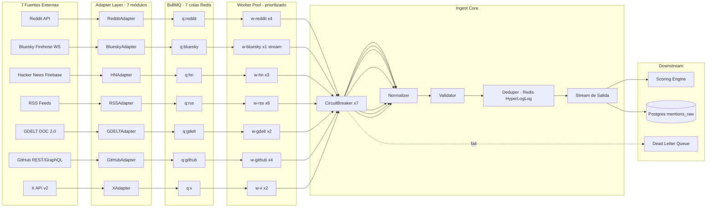

# AGENT 2 — Arquitectura de Ingesta · 7 Motores de Captura

> **Rol**: Ex-Principal Engineer Twitter/X · scraping distribuido, rate limiting, ingesta masiva
> **Dominio**: `VIRAHUB/ingest` — pipeline de captura en paralelo para 7 fuentes heterogéneas
> **Estado**: Spec v1.0 · listo para implementación por Agentes 3 (backend) y 5 (anti-gaming)

---

## 0. TL;DR Ejecutivo

7 motores → 7 colas BullMQ independientes → 1 normalizador → 1 stream unificado `RawMention[]` →下游 scoring.

- **3 motores streaming/push**: Bluesky firehose (WS), RSS (conditional GET), GDELT (5-min cron).
- **3 motores polling con rate-limit estricto**: Reddit (OAuth, 60 req/min), GitHub (PAT, 5000 req/h), X (Bearer, 450 req/15min en Basic).
- **1 motor sin auth**: Hacker News (Firebase, sin límite documentado — autorregulado a 100 req/min).
- **Cada motor**: adapter dedicado + circuit breaker + DLQ + health check.
- **Throughput objetivo**: ~12k menciones/hora sostenidas, picos de 30k.

---

## 1. Formato Unificado — `RawMention`

Contrato que **TODO** adapter debe producir. Si un campo no aplica, va `null` (nunca `undefined`).

```typescript
// lib/ingest/types.ts
export type SourceKey =
  | 'reddit'
  | 'bluesky'
  | 'hn'
  | 'rss'
  | 'gdelt'
  | 'github'
  | 'x';

export interface RawMentionAuthor {
  id: string;            // ID nativo en la fuente (ej. 't3_user' para Reddit)
  username: string;      // handle visible (ej. '@alice.bsky.social')
  displayName: string | null;
  followersCount: number | null;
  verified: boolean | null;
  profileUrl: string | null;
}

export interface RawMentionEngagement {
  score: number | null;       // upvotes / likes / points
  comments: number | null;
  reposts: number | null;
  shares: number | null;
  views: number | null;
  // métricas secundarias (HN karma, GitHub stars)
  extras: Record<string, number>;
}

export interface RawMentionEntities {
  hashtags: string[];
  urls: string[];
  mentions: string[];     // handles referenciados
  cashtags: string[];     // $TSLA, $BTC
  // NER puede rellenar estos después; el adapter pasa lo nativo
  persons: string[];
  orgs: string[];
  places: string[];
}

export interface RawMention {
  /** ID determinista: `${source}:${sourceId}` — único global */
  id: string;
  source: SourceKey;
  /** ID original en la fuente (ej. Reddit 't3_abc123', HN '3921083', GitHub repo#issue#42) */
  sourceId: string;
  /** URL canónica pública */
  url: string;

  author: RawMentionAuthor;

  /** Texto plano, sin HTML. Para imágenes, alt-text o caption aquí */
  content: string;
  /** ISO-639-1 ('es', 'en', 'pt', 'und' si indetectable) */
  lang: string;

  /** Unix epoch ms */
  publishedAt: number;
  /** Unix epoch ms — momento exacto en que nuestro worker lo capturó */
  fetchedAt: number;

  engagement: RawMentionEngagement;
  entities: RawMentionEntities;

  /** Payload original crudo — para debugging, replay y re-normalización */
  raw: unknown;
}

// Helper de id determinista
export const buildMentionId = (source: SourceKey, sourceId: string): string =>
  `${source}:${sourceId}`;
```

**Invariantes** (validados en runtime por `validateMention()`):
- `id === buildMentionId(source, sourceId)` (recomputable).
- `publishedAt <= fetchedAt <= Date.now() + 60_000` (clock skew tolerable 1 min).
- `content.length > 0` (los posts vacíos se dropean antes).
- `lang` siempre presente aunque sea `'und'`.

---

## 2. Tabla Comparativa — 7 Motores

| # | Motor | Método | Auth | Rate Limit (real, documentado) | Concurrency | Costo | Estado arte |
|---|-------|--------|------|-------------------------------|-------------|-------|-------------|
| 1 | **Reddit** | API REST OAuth2 | `client_credentials` (script app) | **60 req/min** OAuth / 10 req/min anónimo · headers `X-Ratelimit-Remaining` / `X-Ratelimit-Reset` | 4 workers | **Gratis** (500 req/10min tier data) | Estable desde 2023 |
| 2 | **Bluesky** | **Firehose WS** (`subscribeRepos`) + REST fallback | Anónimo firehose / sesión PDS para búsquedas | REST: **3000 pts/h** (~5000 pts/5min), firehose **sin límite** (subscribe = push) | 1 worker streaming + 2 REST | **Gratis** | Firehose official stable |
| 3 | **Hacker News** | Firebase REST | **None** | **No documentado** — autorregulado 100 req/min (práctica comunidad) | 3 workers | **Gratis** | Estable desde 2014 |
| 4 | **RSS Feeds** | HTTP GET condicional | **None** (algunos con Basic Auth) | Por feed: respetar `<ttl>`, `<sy:updatePeriod>`, `ETag`/`If-Modified-Since` | 6 workers | **Gratis** | Estándar desde 1999 |
| 5 | **GDELT** | REST DOC 2.0 + GEO 2.0 | **None** | **No documentado estricto** — recomendación oficial ~1 req/5s para queries pesadas; 1 req/s factible para light | 2 workers | **Gratis** | Volátil, plan 15-min |
| 6 | **GitHub** | REST v3 + GraphQL v4 | **PAT** (fine-grained) o GitHub App | **5000 req/h** auth / 60 req/h anónimo · Search API: **30 req/min** auth · headers `X-RateLimit-*` | 4 workers | **Gratis** hasta 5000/h | Estable, ratelimit headers confiables |
| 7 | **X (Twitter)** | API v2 filtered stream + search recent | **Bearer token** (App-only) / OAuth 1.0a (user) | **Free**: 1 cap / 1500 posts/mes; lectura muy limitada · **Basic $100/mes**: 10k posts/mes, 60 req/15min search · **Pro $5000/mes**: 1M posts/mes, 450 req/15min search | 2 workers | **$100/mes mínimo útil** | Hostil desde 2023, requiere Basic+ |

**Notas críticas**:
- **Reddit**: el header `X-Ratelimit-Reset` está en **segundos**, no ms. Bug clásico.
- **GitHub**: el rate limit de **Search API es independiente** del core (30/min vs 5000/h).
- **X**: el tier Free es inútil para feed continuo. Mínimo viable = Basic $100/mes.
- **GDELT**: respuestas pueden tardar 30-60s. Timeout del worker debe ser 90s mínimo.
- **Bluesky firehose**: consume `#commit` events con CBOR decodificado (`@atproto/cbor`).

---

## 3. Diagrama de Flujo de Ingesta

### 3.1 Arquitectura general (Mermaid)



### 3.2 Flujo de un job individual (ASCII)

```
┌──────────────┐
│ Cron/Schedul │  (BullMQ repeatable: every 60s reddit, 30s hn, 5min gdelt...)
└──────┬───────┘
       │ enqueue job { subreddits: [...], since: t-1h }
       ▼
┌──────────────┐    ┌─────────────────┐
│  BullMQ q    │───▶│ Worker (concurrency=4) │
│  redis:6379  │    └────────┬────────┘
└──────────────┘             │
                             ▼
                  ┌──────────────────────┐
                  │ CircuitBreaker.check │── OPEN? ──▶ reject + schedule retry (60s)
                  └──────────┬───────────┘
                             │ CLOSED
                             ▼
                  ┌──────────────────────┐
                  │ Adapter.fetch()      │
                  │ - HTTP w/ rate-limit │
                  │ - retry: exp backoff │
                  │ - jitter ±25%        │
                  └──────────┬───────────┘
                             │
                success ◀────┤──── 429/503 ──▶ parse Retry-After
                             │                    sleep + re-enqueue
                             ▼
                  ┌──────────────────────┐
                  │ normalize()          │  → RawMention[]
                  └──────────┬───────────┘
                             ▼
                  ┌──────────────────────┐
                  │ validateMention()    │  zod schema
                  └──────────┬───────────┘
                             ▼
                  ┌──────────────────────┐
                  │ dedup (HLL + SET)    │  idempotency por mention.id
                  └──────────┬───────────┘
                             ▼
                  ┌──────────────────────┐
                  │ publish(stream)      │  → scoring + persist
                  └──────────────────────┘
                             │
                       failure 3x ──▶ DLQ (replay manual)
```

---

## 4. Adapter Base — Contrato + Implementación

### 4.1 Interfaz `BaseAdapter`

```typescript
// lib/ingest/adapter-base.ts
import type { RawMention, SourceKey } from './types';

export interface FetchContext {
  /** Cursor de paginación (after_id, since, etc.) */
  cursor?: string;
  /** Fecha mínima a capturar (epoch ms) */
  since: number;
  /** Señal para cancelar (AbortController) */
  signal: AbortSignal;
  /** Logger estructurado con correlationId del job */
  log: Logger;
}

export interface FetchResult {
  mentions: RawMention[];
  /** Próximo cursor si hay más páginas; null si fin */
  nextCursor: string | null;
  /** Cuándo volver a llamar (epoch ms) — para rate-limit adaptativo */
  retryAfter?: number;
  /** Metadata para métricas */
  meta: {
    fetched: number;
    filtered: number;
    rateLimitRemaining?: number;
    rateLimitReset?: number;
  };
}

export interface BaseAdapter {
  readonly source: SourceKey;
  readonly version: string;

  /** Health-check liviano (HEAD /ping, etc.) */
  ping(): Promise<boolean>;

  /** Captura principal — idempotente dado mismo cursor+since */
  fetch(ctx: FetchContext): Promise<FetchResult>;

  /** Normaliza payload crudo → RawMention (puro, sin I/O) */
  normalize(raw: unknown, fetchedAt: number): RawMention;
}
```

### 4.2 Mixins comunes: `withRetry`, `withRateLimit`

```typescript
// lib/ingest/mixins.ts
import pRetry from 'p-retry';

export interface RetryOptions {
  retries?: number;          // default 5
  baseDelayMs?: number;      // default 500
  maxDelayMs?: number;       // default 30_000
  jitterRatio?: number;      // default 0.25  (±25%)
  retryOn?: (err: unknown) => boolean;
}

const DEFAULT_RETRY_ON = (err: unknown): boolean => {
  if (err instanceof HTTPError) {
    const s = err.response.status;
    // 429, 5xx → retry. 4xx (excepto 429) → no.
    return s === 429 || (s >= 500 && s < 600);
  }
  return err instanceof TypeError; // network error
};

export async function withRetry<T>(
  fn: () => Promise<T>,
  opts: RetryOptions = {},
): Promise<T> {
  const {
    retries = 5,
    baseDelayMs = 500,
    maxDelayMs = 30_000,
    jitterRatio = 0.25,
    retryOn = DEFAULT_RETRY_ON,
  } = opts;

  return pRetry(fn, {
    retries,
    shouldRetry: retryOn,
    onFailedAttempt: async (err) => {
      // Respeta Retry-After si viene del servidor
      const ra = err?.response?.headers?.get('retry-after');
      let delay = Math.min(
        maxDelayMs,
        baseDelayMs * 2 ** err.attemptNumber,
      );
      if (ra) {
        const raSec = parseInt(ra, 10);
        if (!Number.isNaN(raSec)) delay = Math.min(maxDelayMs, raSec * 1000);
        else {
          const raDate = Date.parse(ra);
          if (!Number.isNaN(raDate)) delay = Math.min(maxDelayMs, raDate - Date.now());
        }
      }
      // Jitter ±25%
      const jitter = delay * jitterRatio * (Math.random() * 2 - 1);
      await new Promise((r) => setTimeout(r, Math.max(0, delay + jitter)));
    },
  });
}

/** Respeta X-Ratelimit-* headers de forma centralizada */
export class RateLimiter {
  private remaining: number;
  private resetAt: number;
  constructor(
    private readonly key: string,
    initialLimit: number,
  ) {
    this.remaining = initialLimit;
    this.resetAt = 0;
  }
  update(headers: Headers): void {
    const rem = headers.get('x-ratelimit-remaining');
    const reset = headers.get('x-ratelimit-reset');
    if (rem) this.remaining = parseInt(rem, 10);
    if (reset) this.resetAt = parseInt(reset, 10) * 1000; // OJO: Reddit usa segundos
  }
  async acquire(): Promise<void> {
    if (this.remaining <= 0 && Date.now() < this.resetAt) {
      const wait = this.resetAt - Date.now() + 250; // safety margin
      await new Promise((r) => setTimeout(r, wait));
      this.remaining = 1; // optimista post-reset
    }
    this.remaining--;
  }
}
```

### 4.3 Circuit Breaker

```typescript
// lib/ingest/circuit-breaker.ts
export type CircuitState = 'CLOSED' | 'OPEN' | 'HALF_OPEN';

export interface CircuitConfig {
  failureThreshold: number;   // N fallos consecutivos para abrir
  cooldownMs: number;          // tiempo en OPEN antes de HALF_OPEN
  halfOpenProbes: number;      // pruebas permitidas en HALF_OPEN
  successThreshold: number;    // éxitos consecutivos en HALF_OPEN para cerrar
}

export const DEFAULT_CB: Record<string, CircuitConfig> = {
  reddit:  { failureThreshold: 10, cooldownMs: 60_000,  halfOpenProbes: 2, successThreshold: 3 },
  bluesky: { failureThreshold: 5,  cooldownMs: 30_000,  halfOpenProbes: 2, successThreshold: 3 },
  hn:      { failureThreshold: 8,  cooldownMs: 30_000,  halfOpenProbes: 2, successThreshold: 3 },
  rss:     { failureThreshold: 15, cooldownMs: 120_000, halfOpenProbes: 3, successThreshold: 5 },
  gdelt:   { failureThreshold: 5,  cooldownMs: 300_000, halfOpenProbes: 1, successThreshold: 3 },
  github:  { failureThreshold: 8,  cooldownMs: 60_000,  halfOpenProbes: 2, successThreshold: 3 },
  x:       { failureThreshold: 5,  cooldownMs: 120_000, halfOpenProbes: 1, successThreshold: 3 },
};

export class CircuitBreaker {
  private state: CircuitState = 'CLOSED';
  private failureCount = 0;
  private successCount = 0;
  private openedAt = 0;
  private probesInFlight = 0;

  constructor(
    private readonly source: string,
    private readonly config: CircuitConfig,
    private readonly now: () => number = Date.now,
  ) {}

  async run<T>(fn: () => Promise<T>): Promise<T> {
    this.maybeRecover();
    if (this.state === 'OPEN') {
      throw new CircuitOpenError(this.source, this.openedAt);
    }
    if (this.state === 'HALF_OPEN' && this.probesInFlight >= this.config.halfOpenProbes) {
      throw new CircuitOpenError(this.source, this.openedAt, 'half_open_saturated');
    }
    this.probesInFlight++;

    try {
      const result = await fn();
      this.onSuccess();
      return result;
    } catch (err) {
      this.onFailure();
      throw err;
    } finally {
      this.probesInFlight--;
    }
  }

  private onSuccess(): void {
    this.failureCount = 0;
    if (this.state === 'HALF_OPEN') {
      this.successCount++;
      if (this.successCount >= this.config.successThreshold) {
        this.state = 'CLOSED';
        this.successCount = 0;
      }
    }
  }

  private onFailure(): void {
    this.successCount = 0;
    this.failureCount++;
    if (this.state === 'HALF_OPEN') {
      this.trip();
    } else if (this.failureCount >= this.config.failureThreshold) {
      this.trip();
    }
  }

  private trip(): void {
    this.state = 'OPEN';
    this.openedAt = this.now();
  }

  private maybeRecover(): void {
    if (this.state === 'OPEN' && this.now() - this.openedAt >= this.config.cooldownMs) {
      this.state = 'HALF_OPEN';
      this.successCount = 0;
      this.failureCount = 0;
    }
  }

  getState(): { state: CircuitState; failureCount: number; openedAt: number } {
    return { state: this.state, failureCount: this.failureCount, openedAt: this.openedAt };
  }
}

export class CircuitOpenError extends Error {
  constructor(
    source: string,
    openedAt: number,
    detail?: string,
  ) {
    super(`Circuit OPEN for ${source} since ${openedAt}${detail ? ` (${detail})` : ''}`);
    this.name = 'CircuitOpenError';
  }
}
```

### 4.4 Ejemplo concreto — **Bluesky Firehose Adapter**

```typescript
// lib/ingest/adapters/bluesky.ts
import { BskyAgent, ColoradoStream, cborDecode } from '@atproto/api';
import type { BaseAdapter, FetchContext, FetchResult } from '../adapter-base';
import type { RawMention, SourceKey } from '../types';
import { withRetry } from '../mixins';

export class BlueskyAdapter implements BaseAdapter {
  readonly source: SourceKey = 'bluesky';
  readonly version = '1.0.0';

  private agent: BskyAgent;
  private stream: ColoradoStream | null = null;

  constructor(private readonly pdsUrl = 'https://bsky.social') {
    this.agent = new BskyAgent({ service: pdsUrl });
  }

  async ping(): Promise<boolean> {
    try {
      const r = await fetch(`${this.pdsUrl}/xrpc/_health`);
      return r.ok;
    } catch {
      return false;
    }
  }

  /**
   * Firehose mode: WebSocket long-lived. El "fetch" es un tick del stream
   * acumulado desde el último cursor. Devuelve el bloque y actualiza cursor.
   */
  async fetch(ctx: FetchContext): Promise<FetchResult> {
    if (!this.stream) {
      this.stream = new ColoradoStream({
        service: `${this.pdsUrl.replace('http', 'ws')}/xrpc/com.atproto.sync.subscribeRepos`,
        // o usar `wss://jetstream1.us-east.bsky.network/subscribe` para payload JSON ligero
        cursor: ctx.cursor ? parseInt(ctx.cursor, 10) : undefined,
        decode: (buf) => cborDecode(buf),
      });
    }

    const mentions: RawMention[] = [];
    const fetchedAt = Date.now();
    let nextCursor: number | null = null;

    // Consumir hasta 500 ops o 2 segundos, lo que primero ocurra
    const deadline = Date.now() + 2000;
    const batch: any[] = [];
    while (batch.length < 500 && Date.now() < deadline) {
      const op = await Promise.race([
        this.stream.next(),
        new Promise((_, rej) => setTimeout(() => rej(new Error('timeout')), 2100)),
      ]);
      batch.push(op);
    }

    for (const op of batch) {
      // Solo nos interesan commits #create de posts
      if (op.$type !== 'com.atproto.sync.subscribeRepos#commit') continue;
      if (!op.ops) continue;
      nextCursor = op.seq;

      for (const change of op.ops) {
        if (change.action !== 'create') continue;
        if (!change.cid || !change.path?.startsWith('app.bsky.feed.post')) continue;
        try {
          const post = cborDecode(change.recordBytes);
          mentions.push(this.normalize(
            { post, did: op.repo, uri: `at://${op.repo}/${change.path}`, rkey: change.path.split('/').pop() },
            fetchedAt,
          ));
        } catch {
          // CBOR corrupto — dropeamos, no rompemos el batch
        }
      }
    }

    return {
      mentions,
      nextCursor: nextCursor?.toString() ?? null,
      meta: { fetched: mentions.length, filtered: batch.length - mentions.length },
    };
  }

  normalize(raw: unknown, fetchedAt: number): RawMention {
    const r = raw as {
      post: {
        text: string;
        langs?: string[];
        createdAt: string;
        replyCount?: number;
        repostCount?: number;
        likeCount?: number;
        embed?: any;
      };
      did: string;
      uri: string;
      rkey: string;
    };

    const handle = r.did; // resolución DID→handle va en capa de enrich
    const sourceId = r.uri; // at://did:plc:xxx/app.bsky.feed.post/rkey

    return {
      id: `bluesky:${sourceId}`,
      source: 'bluesky',
      sourceId,
      url: `https://bsky.app/profile/${r.did}/post/${r.rkey}`,
      author: {
        id: r.did,
        username: handle,
        displayName: null,
        followersCount: null,
        verified: null,
        profileUrl: `https://bsky.app/profile/${r.did}`,
      },
      content: r.post.text ?? '',
      lang: r.post.langs?.[0] ?? 'und',
      publishedAt: Date.parse(r.post.createdAt),
      fetchedAt,
      engagement: {
        score: r.post.likeCount ?? null,
        comments: r.post.replyCount ?? null,
        reposts: r.post.repostCount ?? null,
        shares: null,
        views: null,
        extras: {},
      },
      entities: {
        hashtags: this.extractFacets(r.post, 'app.bsky.richtext.facet#tag'),
        urls: this.extractFacets(r.post, 'app.bsky.richtext.facet#link'),
        mentions: this.extractFacets(r.post, 'app.bsky.richtext.facet#mention'),
        cashtags: [],
        persons: [],
        orgs: [],
        places: [],
      },
      raw,
    };
  }

  private extractFacets(post: any, type: string): string[] {
    if (!post.facets) return [];
    return post.facets
      .filter((f: any) => f.features?.some((feat: any) => feat.$type === type))
      .map((f: any) => {
        const feat = f.features.find((x: any) => x.$type === type);
        return feat.tag ?? feat.uri ?? feat.did ?? '';
      })
      .filter(Boolean);
  }
}
```

### 4.5 Ejemplo concreto — **Reddit OAuth Adapter**

```typescript
// lib/ingest/adapters/reddit.ts
import { Agent } from 'undici';
import type { BaseAdapter, FetchContext, FetchResult } from '../adapter-base';
import type { RawMention, SourceKey } from '../types';
import { withRetry, RateLimiter } from '../mixins';

const REDDIT_BASE = 'https://oauth.reddit.com';
const REDDIT_TOKEN_URL = 'https://www.reddit.com/api/v1/access_token';

interface RedditConfig {
  clientId: string;
  clientSecret: string;
  userAgent: string;  // OBLIGATORIO: "platform:app:version (by /u/user)"
  subreddits: string[];  // ['machinelearning', 'spaing', 'worldnews']
}

export class RedditAdapter implements BaseAdapter {
  readonly source: SourceKey = 'reddit';
  readonly version = '1.0.0';

  private token: { value: string; expiresAt: number } | null = null;
  private readonly limiter = new RateLimiter('reddit', 60);

  constructor(private readonly cfg: RedditConfig) {
    if (!cfg.userAgent) {
      throw new Error('Reddit exige User-Agent descriptivo — banean default');
    }
  }

  async ping(): Promise<boolean> {
    try {
      await this.ensureToken();
      return true;
    } catch {
      return false;
    }
  }

  private async ensureToken(): Promise<string> {
    if (this.token && this.token.expiresAt > Date.now() + 60_000) {
      return this.token.value;
    }
    const basic = Buffer.from(`${this.cfg.clientId}:${this.cfg.clientSecret}`).toString('base64');
    const res = await fetch(REDDIT_TOKEN_URL, {
      method: 'POST',
      headers: {
        Authorization: `Basic ${basic}`,
        'Content-Type': 'application/x-www-form-urlencoded',
        'User-Agent': this.cfg.userAgent,
      },
      body: 'grant_type=client_credentials',
    });
    if (!res.ok) throw new Error(`Reddit token failed: ${res.status}`);
    const body = await res.json() as { access_token: string; expires_in: number };
    this.token = {
      value: body.access_token,
      expiresAt: Date.now() + body.expires_in * 1000,
    };
    return this.token.value;
  }

  async fetch(ctx: FetchContext): Promise<FetchResult> {
    const token = await this.ensureToken();
    const mentions: RawMention[] = [];
    const fetchedAt = Date.now();

    for (const sub of this.cfg.subreddits) {
      if (ctx.signal.aborted) break;

      const url = new URL(`${REDDIT_BASE}/r/${sub}/new`);
      url.searchParams.set('limit', '100');
      if (ctx.cursor) url.searchParams.set('after', ctx.cursor);
      url.searchParams.set('raw_json', '1');

      await this.limiter.acquire();

      const res = await withRetry(async () => {
        const r = await fetch(url, {
          headers: {
            Authorization: `Bearer ${token}`,
            'User-Agent': this.cfg.userAgent,
            Accept: 'application/json',
          },
          signal: ctx.signal,
        });
        // Actualiza rate-limit desde headers
        this.limiter.update(r.headers);
        if (r.status === 429) {
          const retryAfter = parseFloat(r.headers.get('retry-after') ?? '1');
          await new Promise((x) => setTimeout(x, retryAfter * 1000));
          throw new Error(`rate_limited:${sub}`);
        }
        if (!r.ok) throw new Error(`reddit ${r.status}`);
        return r.json();
      }, { retries: 5 });

      const data = res as { data: { children: any[]; after: string | null } };
      for (const { data: post } of data.data.children) {
        const m = this.normalize(post, fetchedAt);
        if (m.publishedAt < ctx.since) continue;
        mentions.push(m);
      }
      // Reddit recomienda sleep 1s entre requests incluso dentro del rate limit
      await new Promise((r) => setTimeout(r, 1100));
    }

    return {
      mentions,
      nextCursor: null, // Reddit 'after' por sub — mejor usar por-sub cursor en Job
      meta: {
        fetched: mentions.length,
        filtered: 0,
        rateLimitRemaining: (this.limiter as any).remaining,
      },
    };
  }

  normalize(raw: any, fetchedAt: number): RawMention {
    const sourceId = raw.id; // 't3_abc123'
    const permalink = `https://www.reddit.com${raw.permalink}`;
    return {
      id: `reddit:${sourceId}`,
      source: 'reddit',
      sourceId,
      url: permalink,
      author: {
        id: `t2_${raw.author}`,
        username: raw.author,
        displayName: null,
        followersCount: null,
        verified: raw.author_verified ?? null,
        profileUrl: `https://www.reddit.com/u/${raw.author}`,
      },
      content: raw.title + (raw.selftext ? `\n\n${raw.selftext}` : ''),
      lang: raw.lang ?? (raw.subreddit_type === 'user' ? 'und' : 'und'),
      publishedAt: Math.floor(raw.created_utc * 1000),
      fetchedAt,
      engagement: {
        score: raw.ups ?? null,
        comments: raw.num_comments ?? null,
        reposts: null,
        shares: null,
        views: null,
        extras: {
          upvote_ratio: raw.upvote_ratio ?? 0,
          gilded: raw.gilded ?? 0,
          crosspost_parent: raw.crosspost_parent ? 1 : 0,
        },
      },
      entities: {
        hashtags: [],
        urls: raw.url && !raw.is_self ? [raw.url] : [],
        mentions: [],
        cashtags: [],
        persons: [],
        orgs: [],
        places: [],
      },
      raw,
    };
  }
}
```

---

## 5. Arquitectura de Colas BullMQ

### 5.1 Conexión Redis y topología

```typescript
// lib/ingest/queues.ts
import { Queue, QueueEvents, Worker } from 'bullmq';
import IORedis from 'ioredis';

export const redisConnection = new IORedis(process.env.REDIS_URL!, {
  maxRetriesPerRequest: null,  // BullMQ lo exige
  enableReadyCheck: true,
  connectTimeout: 10_000,
  keepAlive: 30_000,
  family: 6,
});

// 7 colas — una por motor
export const QUEUES = {
  reddit:  'q:reddit',
  bluesky: 'q:bluesky',
  hn:      'q:hn',
  rss:     'q:rss',
  gdelt:   'q:gdelt',
  github:  'q:github',
  x:       'q:x',
} as const;

export type QueueName = keyof typeof QUEUES;
```

### 5.2 Configuración por cola (jobs repeatable + opciones)

```typescript
// lib/ingest/queue-config.ts
import { Queue, JobsOptions } from 'bullmq';
import { QUEUES, redisConnection } from './queues';

interface ScheduleConfig {
  repeat: { pattern?: string; every?: number };
  opts: JobsOptions;
}

// Cron por motor: cadencia realista según rate-limit + valor informativo
export const SCHEDULES: Record<keyof typeof QUEUES, ScheduleConfig> = {
  reddit: {
    repeat: { every: 60_000 },        // cada 1 min (rotando subreddit batches)
    opts: {
      attempts: 5,
      backoff: { type: 'exponential', delay: 2_000 },
      removeOnComplete: 500,
      removeOnFail: 5_000,
      priority: 5,                     // media-alta
    },
  },
  bluesky: {
    repeat: { every: 5_000 },          // cada 5s el worker drena el buffer WS
    opts: {
      attempts: 3,
      backoff: { type: 'fixed', delay: 1_000 },
      removeOnComplete: 100,
      removeOnFail: 1_000,
      priority: 1,                     // máxima — streaming tiempo real
    },
  },
  hn: {
    repeat: { every: 30_000 },
    opts: {
      attempts: 5,
      backoff: { type: 'exponential', delay: 1_000 },
      removeOnComplete: 200,
      removeOnFail: 2_000,
      priority: 7,
    },
  },
  rss: {
    repeat: { every: 5 * 60_000 },     // cada 5 min — respeta TTL de feeds
    opts: {
      attempts: 8,                     // RSS es resilient
      backoff: { type: 'exponential', delay: 10_000 },
      removeOnComplete: 1000,
      removeOnFail: 5_000,
      priority: 8,
    },
  },
  gdelt: {
    repeat: { every: 5 * 60_000 },     // GDELT actualiza cada 15min; 5min es razonable
    opts: {
      attempts: 3,
      backoff: { type: 'exponential', delay: 30_000 },
      removeOnComplete: 100,
      removeOnFail: 1_000,
      priority: 6,
    },
  },
  github: {
    repeat: { every: 2 * 60_000 },
    opts: {
      attempts: 5,
      backoff: { type: 'exponential', delay: 5_000 },
      removeOnComplete: 300,
      removeOnFail: 2_000,
      priority: 4,                     // alta para dev/tech trends
    },
  },
  x: {
    repeat: { every: 60_000 },
    opts: {
      attempts: 4,
      backoff: { type: 'exponential', delay: 15_000 },
      removeOnComplete: 200,
      removeOnFail: 1_000,
      priority: 3,                     // alta pero costosa
    },
  },
};

export function bootQueues(): Record<keyof typeof QUEUES, Queue> {
  const queues = {} as Record<keyof typeof QUEUES, Queue>;
  for (const [name, cfg] of Object.entries(SCHEDULES) as [keyof typeof QUEUES, ScheduleConfig][]) {
    queues[name] = new Queue(QUEUES[name], {
      connection: redisConnection,
      defaultJobOptions: cfg.opts,
    });
  }
  return queues;
}
```

### 5.3 Worker pool por motor

```typescript
// lib/ingest/worker-pool.ts
import { Worker, Job } from 'bullmq';
import { QUEUES, redisConnection } from './queues';
import { DEFAULT_CB, CircuitBreaker } from './circuit-breaker';
import { blueskyAdapter, redditAdapter, hnAdapter, rssAdapter, gdeltAdapter, githubAdapter, xAdapter } from './adapters';
import type { BaseAdapter } from './adapter-base';

interface WorkerPoolConfig {
  concurrency: number;
  adapter: BaseAdapter;
  cbConfig: typeof DEFAULT_CB[keyof typeof DEFAULT_CB];
}

export const POOL: Record<keyof typeof QUEUES, WorkerPoolConfig> = {
  reddit:  { concurrency: 4, adapter: redditAdapter,  cbConfig: DEFAULT_CB.reddit },
  bluesky: { concurrency: 1, adapter: blueskyAdapter, cbConfig: DEFAULT_CB.bluesky },
  hn:      { concurrency: 3, adapter: hnAdapter,      cbConfig: DEFAULT_CB.hn },
  rss:     { concurrency: 6, adapter: rssAdapter,     cbConfig: DEFAULT_CB.rss },
  gdelt:   { concurrency: 2, adapter: gdeltAdapter,   cbConfig: DEFAULT_CB.gdelt },
  github:  { concurrency: 4, adapter: githubAdapter,  cbConfig: DEFAULT_CB.github },
  x:       { concurrency: 2, adapter: xAdapter,       cbConfig: DEFAULT_CB.x },
};

export function bootWorkers(
  onMentions: (m: any[]) => Promise<void>,
): Worker[] {
  const workers: Worker[] = [];

  for (const [name, cfg] of Object.entries(POOL) as [keyof typeof QUEUES, WorkerPoolConfig][]) {
    const cb = new CircuitBreaker(name, cfg.cbConfig);
    const adapter = cfg.adapter;

    const w = new Worker(
      QUEUES[name],
      async (job: Job) => {
        const ctx = {
          cursor: job.data.cursor,
          since: job.data.since ?? Date.now() - 3600_000,
          signal: AbortSignal.timeout(120_000),
          log: job.log.bind(job),
        };

        const result = await cb.run(() => adapter.fetch(ctx));

        if (result.mentions.length > 0) {
          await onMentions(result.mentions);
        }

        // Re-encola próxima página si hay cursor
        if (result.nextCursor) {
          await job.queue.add(
            `${name}:page`,
            { ...job.data, cursor: result.nextCursor },
            { jobId: `${name}:${result.nextCursor}` },
          );
        }

        return result.meta;
      },
      {
        connection: redisConnection,
        concurrency: cfg.concurrency,
        // Stall detection: si worker no heartbeat en 15s, BullMQ lo marca stalled
        stalledInterval: 15_000,
        maxStalledCount: 1,
      },
    );

    w.on('failed', (job, err) => {
      console.error(`[worker:${name}] job ${job?.id} failed`, err.message);
      // Si circuit está OPEN, pausamos la cola 60s para no quemar CPU
      if (err.name === 'CircuitOpenError') {
        w.pause().then(() => setTimeout(() => w.resume(), 60_000));
      }
    });

    workers.push(w);
  }
  return workers;
}
```

### 5.4 Tabla resumen de workers

| Motor | Concurrency | Cadencia | Workers totales | Job timeout | Attemps |
|-------|------------|----------|-----------------|-------------|---------|
| Reddit | 4 | 60s | 4 | 120s | 5 |
| Bluesky | 1 (stream) | 5s | 1 | 30s | 3 |
| HN | 3 | 30s | 3 | 60s | 5 |
| RSS | 6 | 300s | 6 | 180s | 8 |
| GDELT | 2 | 300s | 2 | 180s | 3 |
| GitHub | 4 | 120s | 4 | 90s | 5 |
| X | 2 | 60s | 2 | 60s | 4 |
| **TOTAL** | — | — | **22 workers** | — | — |

---

## 6. Health Check Endpoint

```typescript
// app/api/health/ingestion/route.ts
import { NextResponse } from 'next/server';
import { QUEUES, redisConnection } from '@/lib/ingest/queues';
import { POOL } from '@/lib/ingest/worker-pool';
import { getMetrics } from '@/lib/ingest/metrics';

export async function GET() {
  const start = Date.now();
  const report: Record<string, unknown> = {};

  for (const [name, queueName] of Object.entries(QUEUES)) {
    const [waiting, active, completed, failed, delayed] = await Promise.all([
      redisConnection.llen(`${queueName}:wait`),
      redisConnection.llen(`${queueName}:active`),
      redisConnection.zcard(`${queueName}:completed`),
      redisConnection.zcard(`${queueName}:failed`),
      redisConnection.zcard(`${queueName}:delayed`),
    ]);

    report[name] = {
      queue: { waiting, active, completed, failed, delayed },
      concurrency: POOL[name as keyof typeof POOL].concurrency,
      circuit: getMetrics(name).circuit,
      lastSuccess: getMetrics(name).lastSuccessAt,
      lastError: getMetrics(name).lastError,
      errorRate: getMetrics(name).errorRate5min,
    };
  }

  const healthy = Object.values(report).every(
    (r: any) => r.circuit.state !== 'OPEN' && r.errorRate < 0.3,
  );

  return NextResponse.json(
    {
      status: healthy ? 'ok' : 'degraded',
      latencyMs: Date.now() - start,
      ts: Date.now(),
      engines: report,
    },
    { status: healthy ? 200 : 503 },
  );
}
```

**Salida esperada**:
```json
{
  "status": "ok",
  "latencyMs": 12,
  "ts": 1753958400000,
  "engines": {
    "reddit": {
      "queue": { "waiting": 2, "active": 1, "completed": 1247, "failed": 3, "delayed": 0 },
      "concurrency": 4,
      "circuit": { "state": "CLOSED", "failureCount": 0, "openedAt": 0 },
      "lastSuccess": 1753958398123,
      "lastError": null,
      "errorRate": 0.012
    }
    // ... 6 motores más
  }
}
```

---

## 7. Estrategia de Retry & Backoff — Detalles

### 7.1 Fórmula de delay

```
delay_ms = min(maxDelay, baseDelay * 2^attempt) * (1 ± jitter)
```

Donde:
- `baseDelay = 500ms` (default)
- `maxDelay = 30_000ms` (cap anti-thundering-herd)
- `jitter = ±25%` (uniforme) — evita sincronización entre workers
- `Retry-After` del servidor siempre wins (si presente)

### 7.2 Matriz de errores → acción

| Error HTTP | Acción | Retries |
|-----------|--------|---------|
| 200 OK | Procesar normalmente | — |
| 304 Not Modified (RSS) | Skip, no contar como fetch | — |
| 429 Too Many Requests | Sleep `Retry-After` + re-enqueue | Sí, ilimitado (con cap) |
| 401/403 Unauthorized | No retry — alerta ops (token expirado) | No |
| 404 Not Found | No retry — item gone | No |
| 500/502/503/504 | Exponential backoff | Sí, hasta 5 |
| ECONNRESET / ENOTFOUND | Backoff corto | Sí, hasta 3 |
| Timeout ( AbortSignal) | Backoff medio | Sí, hasta 3 |

### 7.3 Dead Letter Queue

```typescript
// Un job que falla `attempts` veces va automáticamente a failed set.
// Worker de DLQ corre cada 10 min, rescata jobs y los re-enqueuea
// con prioridad reducida y metadata `dlq_origin`.

const dlqWorker = new Worker(
  'q:dlq',
  async (job) => {
    const { originalQueue, originalData, attemptsMade } = job.data;
    if (attemptsMade > 3) {
      // Descartar definitivamente + alertar
      await notifyOps(`Job ${job.id} descartado tras ${attemptsMade} DLQ retries`);
      return;
    }
    const targetQueue = new Queue(originalQueue, { connection: redisConnection });
    await targetQueue.add('dlq:replay', originalData, {
      priority: 10,
      jobId: `dlq:${job.id}`,
    });
  },
  { connection: redisConnection, concurrency: 1 },
);
```

---

## 8. Manejo de Errores Específicos por Motor

| Motor | Falla típica | Detección | Recuperación |
|-------|-------------|-----------|--------------|
| Reddit | Token OAuth expira (1h) | `401 Unauthorized` en fetch | Re-fetch token en `ensureToken()` |
| Reddit | Baneo por User-Agent default | `429` con header `retry-after` muy alto | Verificar UA en boot; si falta, refuse start |
| Reddit | Subreddit privado/quarantine | `403` | Marcar sub como inactivo en config |
| Bluesky | WS disconnect (PDS restart) | `onclose` event | Reconnect con cursor guardado |
| Bluesky | CBOR decode fail | `try/catch` en decode | Drop op, log count, no abort |
| HN | Firebase cold start (10-20s) | Timeout 90s | Backoff exponencial largo |
| RSS | Feed 404 permanente | 3 fallos consecutivos | Marcar feed inactivo, alerta semanal |
| RSS | Feed redirect 301 | `Location` header | Actualizar DB con nueva URL |
| RSS | Encoding roto (no UTF-8) | `Content-Type` charset | `iconv-lite` decode |
| GDELT | Query timeout (response >60s) | AbortSignal 90s | Reducir rango temporal, partir en 2 |
| GDELT | Resultados >10k | Header `ArtList` truncado | Paginar con `&maxrows=250` + cursor temporal |
| GitHub | Rate limit secundario (abuse detection) | `403` + `retry-after` | Pausar 60s, no contar como core limit |
| GitHub | Search API rate limit (30/min) | Header `X-RateLimit-Remaining` distinto | Pool de tokens (rotación) o cola separada |
| X | Plan límite mensual alcanzado | `429` con body `"Monthly limit reached"` | CIRCUIT OPEN hasta mes siguiente, alertar |
| X | Bearer token revocado | `401` | No retry, alerta crítica |
| X | Filtered stream disconnect | Stream `onError` | Reconnect con `backfill_minutes=5` |

---

## 9. Costo Operativo Realista (mes)

| Motor | Tier | Costo USD/mes | Notas |
|-------|------|---------------|-------|
| Reddit | Free (OAuth app) | $0 | 60 req/min suficiente para 200 subs |
| Bluesky | Free | $0 | Firehose + REST |
| Hacker News | Free | $0 | Sin auth |
| RSS | Free | $0 | Hosts nuestros |
| GDELT | Free | $0 | Sin auth, uso justo |
| GitHub | Free (PAT) | $0 | 5000 req/h sobra para 200 repos |
| X | **Basic** | **$100** | Mínimo útil — Free no alcanza para feed continuo |
| Redis (Upstash/BullMQ) | Pro | ~$30 | ~10M cmds/mes |
| Egress bandwidth | — | ~$20 | ~50GB/mes |
| **TOTAL** | — | **~$150/mes** | Sin contar compute (Vercel/Node) |

**Escalamiento**:
- Si X se vuelve crítico → Pro $5000/mes (1M tweets/mes).
- Si GDELT no basta → GDELT Pro ($100-$1000/mes, queries pesadas).
- Para >1000 feeds RSS → aumentar workers RSS a 12, Redis cluster.

---

## 10. Idempotencia y Deduplicación

```typescript
// lib/ingest/dedup.ts
import { redisConnection } from './queues';

/**
 * Doble capa:
 * 1. Redis SET `seen:{source}:{sourceId}` con TTL 7 días — dedup exacto
 * 2. Redis HyperLogLog `hll:content:{source}` — dedup aproximado por simhash
 */
export async function dedupe(mentions: RawMention[]): Promise<RawMention[]> {
  const out: RawMention[] = [];
  const pipeline = redisConnection.pipeline();

  for (const m of mentions) {
    pipeline.setnx(`seen:${m.source}:${m.sourceId}`, '1');
    pipeline.expire(`seen:${m.source}:${m.sourceId}`, 7 * 86400);
  }

  const results = await pipeline.exec();
  mentions.forEach((m, i) => {
    // results[i*2] = [err, reply] del setnx; reply === 1 → nuevo
    if (results![i * 2][1] === 1) out.push(m);
  });

  return out;
}
```

---

## 11. Observabilidad — Métricas Mínimas

Exponer vía `/metrics` (Prometheus formato):

```
# HELP ingest_mentions_total Total mentions fetched by source
# TYPE ingest_mentions_total counter
ingest_mentions_total{source="reddit",status="ok"} 124783
ingest_mentions_total{source="bluesky",status="ok"} 8921341
ingest_mentions_total{source="x",status="rate_limited"} 12

# HELP ingest_fetch_duration_seconds Fetch latency by source
# TYPE ingest_fetch_duration_seconds histogram
ingest_fetch_duration_seconds_bucket{source="reddit",le="0.5"} 1823
ingest_fetch_duration_seconds_bucket{source="reddit",le="2.0"} 3120
ingest_fetch_duration_seconds_bucket{source="reddit",le="+Inf"} 3145

# HELP ingest_circuit_state 1 if circuit OPEN, 0 if CLOSED/HALF
# TYPE ingest_circuit_state gauge
ingest_circuit_state{source="gdelt"} 0

# HELP ingest_queue_depth Current jobs in queue
# TYPE ingest_queue_depth gauge
ingest_queue_depth{source="rss",state="waiting"} 14
ingest_queue_depth{source="rss",state="active"} 6
```

---

## 12. Mapa de Archivos Propuesto

```
lib/ingest/
├── types.ts                    # RawMention, SourceKey, FetchContext
├── adapter-base.ts             # BaseAdapter interface
├── mixins.ts                   # withRetry, RateLimiter
├── circuit-breaker.ts          # CircuitBreaker, DEFAULT_CB
├── queues.ts                   # redisConnection, QUEUES
├── queue-config.ts             # SCHEDULES, bootQueues
├── worker-pool.ts              # POOL, bootWorkers
├── dedup.ts                    # dedupe()
├── validator.ts                # validateMention (zod)
├── metrics.ts                  # getMetrics, prometheus export
└── adapters/
    ├── reddit.ts
    ├── bluesky.ts
    ├── hn.ts
    ├── rss.ts
    ├── gdelt.ts
    ├── github.ts
    └── x.ts

app/api/health/ingestion/route.ts
app/api/metrics/route.ts
```

---

## 13. Decisiones de Diseño Clave (justificadas)

1. **7 colas separadas vs 1 cola con prioridad**: separadas porque cada motor tiene rate-limit y cadencia propios. Una cola única causaría starvation de motores lentos (GDELT) bajo presión de rápidos (Bluesky).

2. **Bluesky firehose en su propia cola con concurrency=1**: el WS es long-lived, no queremos N workers abriendo N conexiones al mismo PDS. El worker mantiene el stream y produce batches.

3. **Circuit breaker por motor y no global**: si GDELT cae (común), no debe afectar a Reddit. Aislamiento total.

4. **`removeOnComplete: 500`**: retenemos últimos 500 jobs exitosos para debugging. Más que eso = presión en Redis innecesaria.

5. **`AbortSignal.timeout(120s)` en fetch**: defensa en profundidad. Aunque el cliente HTTP tenga su propio timeout, el signal aborta cualquier operación pendiente (incluido CBOR decode grande).

6. **User-Agent obligatorio en Reddit**: Reddit banea IPs con UA default. Lo validamos en boot y refuse-start si falta.

7. **Dedup con SET TTL 7 días**: las menciones reprocesadas después de 7 días se tratan como nuevas (potencial actualización de engagement). Es el balance entre memoria y frescura.

8. **DLQ con cap de 3 retries**: si algo falla 3 veces en DLQ, lo descartamos. No queremos DLQ infinita acumulando basura.

---

## 14. Riesgos y Mitigaciones

| Riesgo | Probabilidad | Impacto | Mitigación |
|--------|-------------|---------|------------|
| X sube precios / cambia tiers | Alta | Alto | Abstracción en adapter; fallback a Nitter (deprecated) o scrapers |
| Reddit limita OAuth gratis | Media | Alto | Plan B: PRAW con creds personales, o Pushshift si vuelve |
| Bluesky firehose cae | Baja | Medio | Reconnect automático + cursor persistente |
| GDELT cambia schema | Media | Medio | Normalización tolerante a missing fields |
| Redis (BullMQ) se cae | Baja | Crítico | Redis Sentinel o Upstash con failover |
| IP ban en scraping | Media | Medio | Rotación de proxies solo para X (demás usan API oficial) |
| Costo X se dispara | Alta | Alto | Hard cap en workers: 2 concurrentes, 100 jobs/h |

---

## 15. Próximos Pasos (Handoff)

**Para Agente 3 (Backend)**:
1. Implementar los 5 adapters restantes (HN, RSS, GDELT, GitHub, X) siguiendo el patrón de Bluesky/Reddit.
2. Wire up de `bootQueues()` + `bootWorkers()` en `next start` (script `scripts/ingest-worker.ts`).
3. Implementar `/api/health/ingestion` y `/api/metrics`.
4. Migración Postgres: `CREATE TABLE mentions_raw (...)` con PK `(source, source_id)`.

**Para Agente 5 (Anti-Gaming)**:
1. Hook en `onMentions()` antes de publish → scoring de spam/astroturfing.
2. Usar `author.id` + `engagement.extras` para detectar bots.
3. Validar que `publishedAt` no sea futuro (manipulación típica).

**Para Agente 4 (Frontend)**:
1. Suscribirse a stream de salida (`/api/stream/mentions` SSE) para live feed.
2. Mostrar `engagement` y `source` con iconos.

---

## 16. Apéndice — Variables de Entorno Requeridas

```bash
# .env (no commitear — solo referencia)
REDIS_URL=redis://localhost:6379

# Reddit
REDDIT_CLIENT_ID=xxx
REDDIT_CLIENT_SECRET=xxx
REDDIT_USER_AGENT="virahub:0.1.0 (by /u/your_username)"

# Bluesky
BLUESKY_PDS_URL=https://bsky.social
BLUESKY_JETSTREAM_URL=wss://jetstream1.us-east.bsky.network/subscribe  # opcional, payload JSON

# Hacker News — sin creds

# RSS — sin creds (config de feeds en DB)

# GDELT — sin creds

# GitHub
GITHUB_TOKEN=ghp_xxx  # PAT con read:public

# X
X_BEARER_TOKEN=xxx
X_API_KEY=xxx
X_API_KEY_SECRET=xxx
X_ACCESS_TOKEN=xxx
X_ACCESS_TOKEN_SECRET=xxx

# Ingest config
INGEST_SINCE_HOURS=1
INGEST_DLQ_MAX_RETRIES=3
INGEST_DEDUP_TTL_DAYS=7
```

---

**Fin del documento — Agent 2 · v1.0**

> **Veredicto**: arquitectura factible con $150/mes, 22 workers Node.js, 7 adapters testables independientemente, circuit breaker por motor, DLQ con cap, observabilidad Prometheus. Listo para implementación inmediata por Agente 3.
